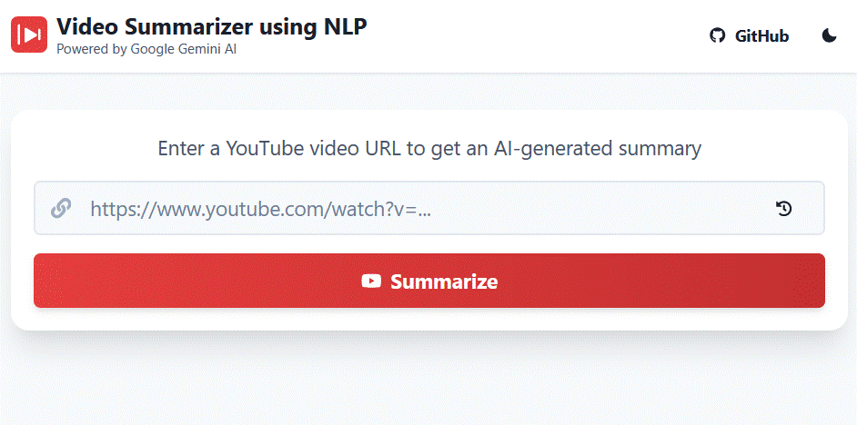

# 🎥 Video Summarizer Using NLP

[](https://github.com/your-username/your-repo/actions)
[](https://reactjs.org/)
[](https://fastapi.tiangolo.com/)
[](https://example.com/)
[](https://www.typescriptlang.org/)

A powerful web application that **automatically generates comprehensive summaries** of YouTube videos using advanced **Natural Language Processing (NLP)** techniques. This project combines **advanced AI technologies**, **YouTube's Transcript API**, and **modern web technologies** to offer intelligent video summarization with a clean UI.

## 🖼️ Demo



## ✨ Features

- 🎯 **Smart Video Analysis**: Automatically extracts and processes video transcripts
- 🤖 **AI-Powered Summarization**: Utilizes advanced AI for intelligent content analysis
- 🌍**Multi-Language Support**: Handles videos in various languages with automatic translation
- 🧠**Rich Video Metadata**: Extracts comprehensive video information
- **Music Video Detection**: Intelligent detection of music videos
- 💻**Modern Web Interface**: Clean and responsive frontend
- 🎮**3D Animation Background**: Engaging animated background effects
- 🔗**RESTful API**: FastAPI backend for efficient video processing

## 🛠️ Tech Stack

### Frontend
- React + TypeScript
- Chakra UI
- Vite
- React Markdown
- Three.js (for 3D animations)

### Backend
- FastAPI
- Advanced AI
- YouTube Transcript API

## 📁 Project Structure

├── frontend/ # React + TypeScript frontend application 

├── main.py # FastAPI backend server 

├── .env # Environment configuration 

└── README.md # Project documentation


---

## 🔑 Key Highlights

- ✅ Automatic transcript extraction and processing  
- ✅ AI-based summarization using advanced technology  
- ✅ Multi-language support and auto-translation  
- ✅ Metadata extraction: title, author, description, etc.  
- ✅ Music video detection  
- ✅ Error handling and CORS-enabled APIs  
- ✅ Interactive 3D animation in background for enhanced user experience

---

## 🎯 Use Cases

- 📚 Educational video summarization  
- 🔬 Research and study support  
- 🎥 Content creators' productivity tool   
- ⏩ Instant video content preview  

---

## ⚙️ Getting Started

### Prerequisites
- Node.js (v16 or higher)
- Python (v3.8 or higher)
- API Key for the AI service

### Installation

1. Clone the repository
```bash
git clone https://github.com/your-username/video-summarizer.git
cd video-summarizer
```

2. Install frontend dependencies
```bash
cd frontend
npm install
```

3. Set up environment variables
```bash
cp .env.example .env
# Add your API key to .env
```

4. Start the development servers
```bash
# Terminal 1 - Backend
python main.py

# Terminal 2 - Frontend
cd frontend
npm run dev
```

## 📝 Usage

1. Open your browser and navigate to `http://localhost:5173`
2. Paste a YouTube video URL
3. Click "Summarize"
4. View the generated summary and video information

## 🤝 Contributing

Contributions are welcome! Please feel free to submit a Pull Request.

## 📄 License

This project is licensed under the MIT License - see the [LICENSE](LICENSE) file for details.

## 🙏 Acknowledgments

- [YouTube Transcript API](https://github.com/jdepoix/youtube-transcript-api)
- [FastAPI](https://fastapi.tiangolo.com/)
- [React](https://reactjs.org/)
